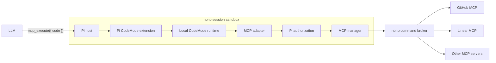

# pi-codemode

A Pi extension that exposes configured MCP servers to the model through one confined tool:

```text
mcp_execute({ code })
```



## What it uses

- **Pi** as the host, lifecycle owner, and authorization boundary
- **Vendored CodeMode** as a restricted JavaScript interpreter and tool runtime
- **MCP SDK** for stdio, Streamable HTTP, and SSE server connections
- **Nono** for outer process isolation and optional per-server child sandboxes
- **Effect**, **Acorn**, **TypeBox**, and **TypeScript**

CodeMode has no filesystem, process, module, timer, `fetch`, Pi, MCP, or ambient network APIs. It can only call the MCP tools supplied by the Pi adapter. Pi authorizes every child call before it reaches an MCP client.

## Install

```bash
git clone https://github.com/Yeshwanthyk/pi-codemode.git
cd pi-codemode
npm install
pi install .
```

For local development:

```bash
pi -e ./src/index.ts
```

Use `/mcp` for status, authentication, tool policy, and reconnect operations. The model sees only `mcp_execute`.

## Verify

```bash
npm run build
npm run typecheck
npm test
npm run proof:nono
```

Vendored CodeMode provenance is recorded in [`src/codemode/UPSTREAM.md`](src/codemode/UPSTREAM.md).
